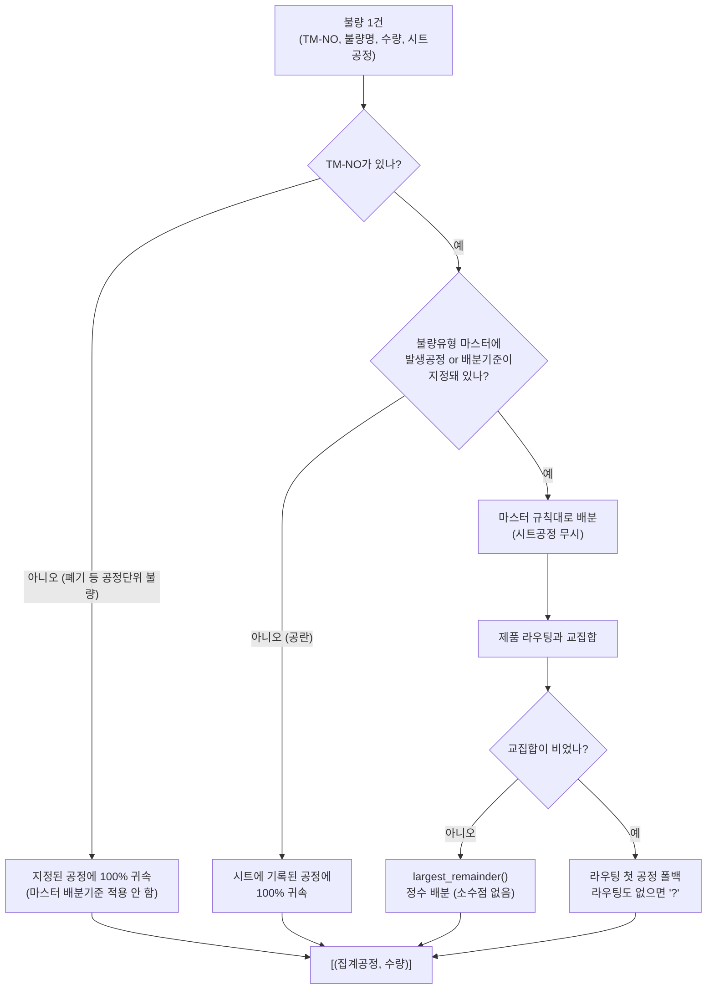
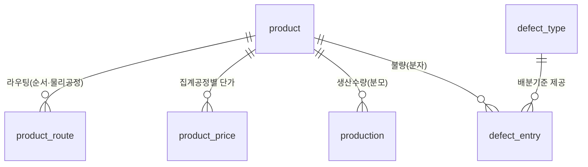

# 시스템 구조 (ARCHITECTURE)

> **이 문서의 목적**: 새 세션/새 담당자가 이 문서 하나만 읽고도 시스템 전체를 파악할 수 있게 한다.
> 코드를 바꿨는데 이 문서와 어긋나면, **이 문서를 같이 고친다.**
>
> 관련 문서 — 요구사항·마일스톤: `plan.md` · 작업 로그: `status.md` · 코딩 규칙: `CLAUDE.md`

---

## 1. 한 장 요약

Johnson Electric Operations의 품질 KPI(Scrap·COPQ·불량율·Claim·Incident)를
**Excel/DB 원천 → SQLite 적재 → 계산 → 웹 대시보드**로 잇는 사내 시스템.

| 항목 | 값 |
|---|---|
| 스택 | Python 3.11 · FastAPI · SQLite · Jinja2 · 순수 JS(SVG 차트, 라이브러리 없음) |
| 포트 | **5003** |
| DB 파일 | `qms.db` (리포지토리 루트, `QMS_DB` 환경변수로 변경 가능) |
| 회계연도(FY) | **4월~익년 3월**. FY 이름 = 종료연도 뒤 2자리 → 2026-07은 **FY27** |
| 파트 | DB 저장값 `VMS PART` / `TM PART` ↔ 화면 표기 **1PART / 2PART** |
| 권한 | 조회자(viewer) / 입력자(editor) / 관리자(admin) |

---

## 2. 전체 데이터 흐름


### 2단계 운영 흐름 (중요)

시스템은 **두 가지 경로**로 데이터를 받는다. 목적이 다르므로 섞지 않는다.

| | ① 초기 구축 | ② 운영(신규 수집) |
|---|---|---|
| 모듈 | `app/init_data.py` | `app/scan.py` |
| 입력 위치 | 리포지토리 `templates/` 폴더 | 서버 공유 폴더 `\\carp130001\TheEyesHaveIt\QC_Data\Quality_Data` |
| 실행 방법 | `python -m app.init_data` 또는 `/admin/scan` 화면의 **초기 구축** 버튼 | `/admin/scan` 화면의 **폴더 반영** 버튼 (향후 자동 주기) |
| 횟수 | 최초 1회 | 반복 (멱등) |

> `templates/` 는 초기 구축에만 쓰고, 이후에는 보지 않는다.

### 공유 폴더 구조

```
\\carp130001\TheEyesHaveIt\QC_Data\Quality_Data\
  01_사내불량\{연도}\{1파트|2파트}\{월}\        ← 재귀 스캔, 파일명으로 파트/공정/구분/월 판단
  02_생산량\{YYYY-MM}\
  03_외주소재\00_sintering_defect.xlsm          ← 고정 파일, 전체 교체
  04_폐기불량\scrap_data.db                      ← 고정 파일, 전체 교체
  05_단가마스터\제품별 단가 Master_*.xlsx        ← 최신 파일 1개 upsert
```

사내불량 월별시트 파일명 규칙(2026-07~): `{YYMM}_{공정}_{공정불량|셋팅불량}_생산{1|2}파트.xlsx`
(예: `2607_성형_공정불량_생산1파트.xlsx`). 파일 1개 = 월 1개, 시트 `1`~`31`(해당월 일자)에
TM-NO×세부불량유형 표, `종합` 시트는 무시. (구 방식이었던 일별 개별파일
`1PART_성형_공정불량_20260724.xlsx`은 더 이상 스캔하지 않음 — 과거 데이터는 이미 DB에 반영됨.)

**원칙**: 폴더의 파일은 **읽기만** 한다(수정·이동·삭제 없음).
재적재는 멱등 — 사내불량은 `batch_key`(파트\|공정\|구분\|일자, **일자 단위**) 교체,
외주/폐기는 `source` 전체 교체(단, 이번 달 이전 데이터는 잠금 — §5 참고), 생산/단가는 upsert.
단, **`reviewed=1` 행(사람이 검토한 100EA 건)은 재스캔해도 보존**한다.

---

## 3. 모듈 지도

```
app/
  db.py         SQLite 스키마·연결·마이그레이션·공정 정의(bucket_of)
  ingest.py     원천 파일 → DB 적재 (파일 형식별 ingest_* 함수 20여 개)
  scan.py       공유 폴더 순회 → ingest 호출 (scan_all이 단일 진입점)
  init_data.py  templates/ 실데이터로 최초 1회 DB 구축
  calc.py       ★ 계산 엔진 — 배분·KPI·세부지표 분석
  main.py       ★ FastAPI 라우트·인증·화면 조립
  seed.py       (데모용) 샘플 Excel 일괄 적재
  setpw.py      비밀번호 변경 CLI
  templates/    Jinja2 화면
  static/       qms.css · charts.js(SVG 차트 렌더러) · theme.js(다크모드)
scripts/
  gen_daily_defect_templates.py   일일 불량 입력시트 양식 생성기
  gen_sample.py                   (데모용) 샘플 Excel 생성기
templates/      초기 구축용 실데이터 + 업로드 양식(.xlsx)
deploy/         Windows 상시구동·백업 배치 (DEPLOY.md 참고)
```

**핵심 파일 2개**: `calc.py`(무엇을 어떻게 계산하는가) + `main.py`(무엇을 어떻게 보여주는가).
수정할 일이 생기면 대부분 이 둘 중 하나다.

---

## 4. 공정 체계 (가장 헷갈리는 부분)

공정에는 **두 층**이 있다. 이걸 섞으면 반드시 버그가 난다.

```
물리공정 7종 (db.PHYS_PROCESSES)        →  집계공정 5종 (db.AGG_PROCESSES)
제품 라우팅·일일시트에 쓰이는 실제 공정      화면·KPI에 표시되는 단위
─────────────────────────────────────────────────────────────
성형 ──────────────────────────────────→  성형
소결 ──────────────────────────────────→  소결
정형 ──────────────────────────────────→  정형
가공 ──────────────────────────────────→  가공
압입 ┐
밴딩 ├─────────────────────────────────→  기타   (화면 표기: "기타후공정")
선별 ┘
```

- 매핑 함수: `db.bucket_of(물리공정) → 집계공정`
- **공정별 불량현황은 집계공정 5종만 표시**한다.
- 화면 표기: `main.PROC_LABEL = {"기타": "기타후공정", "?": "(공정미상)"}`
- `?` = 제품 마스터에 없는 TM-NO라 공정을 특정할 수 없는 경우.
  현재 7건(88EA) 존재 — 제품 마스터에 등록하면 사라진다.

---

## 5. 불량 → 공정 배분 규칙

사내 불량시트는 여러 공정에서 작성하지만, **불량은 "발생한 공정"에 집계**한다.
시트를 어느 공정에서 썼는지가 아니라 **불량유형 마스터의 배분기준**이 우선이다.



배분기준 표기법 (`defect_type.alloc_rule`):

| 표기 | 의미 |
|---|---|
| `소결,정형` | 두 공정에 **균등** 배분 |
| `정형:70,성형:30` | 비율 배분 |
| 빈칸 또는 `입력공정 100%` | 시트를 작성한 공정에 100% 귀속 |

**TM-NO 없는 불량**(폐기의 소결로_산화 등 품목을 특정할 수 없는 공정단위 불량):
품목 라우팅이 없어 배분기준을 적용할 수 없다. **특정 TM-NO에 넣지 않고 입력에 지정된 공정
100%** 로만 집계한다. 파트는 저장된 `defect_entry.part` 로 판단한다.
(TM-NO별 TOP5 등 품목 축 집계에는 애초에 잡히지 않고, 세부지표의 TM-NO 축에서는 `(미지정)` 으로 묶인다.)

**주의**: `Masters.defect` 는 `(part, name)` 으로 키잉한다.
파트마다 같은 불량명의 배분기준이 다른 경우가 22건 있어서, 불량명만으로 키잉하면 충돌한다.

### 확정된 계산 규칙 (사용자 확정, 변경 금지)

1. **분모는 공통** — 모든 불량율의 분모는 생산(입고)수량.
2. **외주소재불량·폐기불량은 별도 불량율을 계산하지 않는다.** 불량유형별로 해당 공정의 공정불량 수량에 **합산만** 한다.
3. **비집계 공정(압입·밴딩·선별)의 불량도** 유형별 해당 집계공정에 포함시킨다.
4. **발생일 기준**으로 정리한다.
5. **성형 공정에서 작성한 시트의 데이터** (다른 공정 시트에 기록된 "성형 원인" 불량은
   이 규칙과 무관하게 정상 반영 — 둘은 다른 얘기다):
   - **공정불량** → DB에 전혀 반영하지 않는다(파일 자체 미반영).
   - **셋팅불량**(2026-07-28 확정, 그 전엔 공정불량과 동일하게 전량 미반영이었음) → DB엔
     반영해 **셋팅불량율에는 포함**시키되, **Scrap Cost·COPQ 계산에서는 제외**한다
     (`defect_entry.exclude_cost=1`, `calc.compute_daily()`가 이 플래그면 수량은 누적하고
     비용만 건너뜀).
6. Scrap Quantity·Scrap Cost = **공정불량 + 셋팅불량** 합산.
7. **COPQ/Scrap에서 성형을 제외하는 규칙은 없다.** (5번의 시트 제외와 혼동 금지)
8. **공정별 단가(성형/소결/정형/가공/기타) 산출 규칙**(2026-07-28 확정, `app/price_calc.py`):
   - "나머지공정단가" = 최근 3개월 `production`(입고) 실적의 (입고금액 합 ÷ 입고수량 합).
     여러 고객사로 출하돼 단가가 섞여 있어도 수량 가중평균이 되도록 금액/수량을 합산 후 나눈다.
   - 정형공정이 있는 품목: 성형=나머지×0.5, 소결=나머지×0.6, 정형=나머지×0.8.
     정형공정이 없는 품목: 성형=나머지×0.6, 소결=나머지×0.8.
   - **가공·기타는 항상 나머지공정단가 그대로**(둘이 같은 값).
   - 최근 3개월 입고실적이 없는 TM-NO는 계산하지 않고 **기존 단가를 그대로 둔다.**
   - `product_price`는 `(tm_no, process, effective_from)` 단위로 이력을 쌓는다. 매년 4월 1일
     (`QMS_PriceUpdate` 작업 스케줄러, `deploy/update_price.bat`) 재계산 시 **그 해 4월 1일부터만
     적용**되도록 새 effective_from을 추가하고, 그 이전 원가 계산은 이전 단가를 그대로 쓴다
     (`calc.Masters.price_on(tm_no, proc, d)` 가 발생일 기준으로 유효한 단가를 고른다).
9. **라우팅(`product_route`) 공정 유무 판정 규칙**(2026-07-28 확정):
   - **정형**: 정형단가가 0이거나 **기타단가와 같으면** 정형공정 없음(라우팅에서 제거, 기타와
     같아서 제거한 경우 정형단가도 0으로). 0도 아니고 기타와도 다른데 라우팅에 없으면 추가.
   - **압입**: 품명에 `ROD GUIDE·ROD GUIDE ASSY·R/GUIDE·R/GUIDE ASSY·S/YOKE·S/YOKE ASSY·
     SUPPORT YOKE·SUPPORT YOKE ASSY` 중 하나라도 포함(공백·아포스트로피 무시) → 있으면 추가,
     없으면 제거.
   - **가공**: **1PART**이면서 품명에 "PISTON" 포함 → 있으면 추가, 없으면 제거. 2PART는 이
     규칙 대상이 아님(건드리지 않음).
   - **성형·소결**: 단가는 있는데 라우팅에 없으면 추가만(제거 없음).
   - **주의**: 단가 존재 여부만으로 라우팅을 역산하는 건 **일반적으로 신뢰할 수 없다**
     (`ingest_price_master`가 정형 없는 품목도 완제품단가를 정형칸에 채워 넣는 방식이라
     "정형단가 있음"이 곧 "정형공정 있음"을 의미하지 않음). 위 규칙처럼 **"정형==기타"
     비교**나 **품명 패턴** 등 신뢰 가능한 조건으로만 판단해야 한다.
10. **과거월 데이터 잠금**(2026-07-28 확정, 폐기·외주소재불량): 이번 달 1일 이전 날짜의 데이터는
    원본(scrap_data.db·xlsm)이 사후에 바뀌어도 재스캔 시 무시하고 DB 값을 그대로 유지한다
    (`ingest._reingest_preserve_reviewed()`). 2026년 7월까지는 사용자가 `qms.db`를 직접 수정하므로
    이 규칙은 8월 이후부터 실질적으로 의미를 갖는다. 사내불량(월별시트)은 `batch_key`가 이미
    파트\|공정\|구분\|**일자** 단위라 재스캔해도 그 날짜 배치만 교체되므로 별도 잠금이 필요 없다.
11. **폐기(scrap_data.db) 불량명 세부화**(2026-07-28 확정): `scrap_reason='기타_불량'`이고
    `remark`(비고)에 사유가 적혀있으면, 불량명을 `기타_불량` 대신 **remark 내용만**(접두어 없이)
    표시한다. TOP5 등 집계에도 세부 사유가 그대로 반영된다.
12. **외주소재불량(xlsm) 불량명 세부화**(2026-07-28 확정): 성형/소결/기타 3개 뭉친 합계 대신,
    xlsm의 19개 세부 불량명 컬럼을 그대로 불량명으로 반영한다. VBA(Module1)의 그룹화 공식을
    olevba로 직접 확인 후 반영: 깨짐·크랙·기포·뜯김·밸런스NG→성형, 변형(촥좌)·변형(Window)·
    변형(쏠림)·브레이징·조립불량·변형(편가공)·산화·용침불량·소결붙음→소결로 직접 매핑.
    원래 VBA가 소결/기타에 50%씩 임의로 나누던 애매한 5종(찍힘.눌림/이종혼입/녹/이물소착/
    소재돌출)은 **TM-NO의 제품 라우팅에 정형이 있으면 정형, 없으면 소결**로 배분. TM-NO 없는
    행(제품 미지정/날짜 오인식)은 라우팅 판단이 불가능하므로 **집계에서 제외**한다.
13. **주간 집계는 월요일~일요일**(2026-07-28 확정, `calc.week_of_month()`): 요일 무관 단순 7일
    청크가 아니라 실제 캘린더 주(월~일) 기준. 단, 주가 두 달에 걸치지 않도록 월 경계에서 첫 주·
    마지막 주는 그 달 안쪽으로 잘라낸다(1일이 수요일이면 1주=수~일, 마지막날이 화요일이면
    마지막주=월~화). 인터넷 없이도 파이썬 표준 라이브러리(`date.weekday()`)로 매년 자동 계산됨.
14. **생산량 다일범위 파일은 평일에만 균등 분배**(2026-07-28 확정): 파일명이
    `{1part|2part}_{시작}_{종료}.xlsx`로 여러 날 범위를 나타낼 때, **토·일요일을 제외한 평일에만**
    수량·금액을 균등 분배한다(예: 목~일 범위면 목·금 2일로 분해). 하루짜리 파일(시작일=종료일)은
    그대로 100%. 수량은 `calc.largest_remainder()`로 정수 배분(합계 보존), 금액은 균등 나눗셈.
15. **생산량 미등록 날짜의 불량은 지표에서 자동 제외**(2026-07-28 확정): `calc.compute_daily()`가
    파트별(`VMS PART`/`TM PART`) `production` 테이블의 `MAX(d)`를 컷오프로 삼아, 그 날짜보다 이후
    날짜에 등록된 불량은 분모(생산량)가 아직 확정되지 않았다고 보고 집계에서 제외한다(생산량이
    아예 없는 파트는 전부 제외). 생산량이 나중에 등록되면 다음 계산 시 자동으로 반영된다 — 모든
    KPI 카드가 `compute_daily()`를 거치므로 이 한 곳으로 전체 지표에 일괄 적용됨.

---

## 6. TM-NO 정규화

여러 파일의 표기 흔들림을 하나의 base 키로 통일한다 (`calc.base_tmno`).

| 규칙 | 예 |
|---|---|
| ① 접미 알파벳 제거 | `598-10A`, `598-10B` → `598-10` |
| ② 접미부 2자리 0채움 | `588-5` → `588-05` |
| ③ 접미부 없으면 `-00` | `1632`, `1632-0` → `1632-00` |

안전장치: 접미부가 숫자가 아니면(Excel이 날짜로 깨뜨린 값 등) 손대지 않고 원본 유지.
TM-NO는 **전 구간 TEXT**로 저장한다(날짜 자동변환 방지).

정규화 규칙이 바뀌면 `db._normalize_tmno()` 마이그레이션이 기존 행을 재정규화한다.

---

## 7. DB 스키마



| 테이블 | 역할 | 핵심 컬럼 |
|---|---|---|
| `product` | 제품 마스터 | `tm_no`(PK), `name`, `part` |
| `product_route` | 제품별 공정 순서 | `tm_no`, `seq`, `process`(물리공정), `unit_price` |
| `product_price` | 집계공정별 누적단가(원) | `tm_no`, `process`(집계 5종), `unit_price` |
| `defect_type` | 불량유형 마스터 | `part`, `kind`(공정\|셋팅), `process`(발생공정), `name`, `alloc_rule` |
| `defect_entry` | **불량 실적(분자)** | `d`, `tm_no`, `defect_name`, `qty`, `source`, `status`, `batch_key`, `reviewed` |
| `production` | **생산수량(분모)** | `d`, `tm_no`, `qty`, `amount`(천원) |
| `svp` | 월별 SVP(매출) | `ym`, `part`, `amount`(천원) — COPQ/Scrap Cost 분모 |
| `claim` | Claim 6항목 비용 | `ym`, `part`, `item`, `amount` |
| `incident` | Customer Incident | `d`, `part`, `customer` |
| `kpi_actual` | **과거 월 KPI 실적** | `ym`, `part`, `kpi`, `value` — 계산값보다 **우선** |
| `target` | KPI 목표 | `fy`, `part`, `kpi`, `value`, `mon`(0=연간, 1~12=월별) |
| `setting` | 설정(`data_root` 등) | `k`, `v` |
| `upload_log` | 적재 이력 | `ts`, `kind`, `filename`, `ok`, `note` |

**`defect_entry` 특수 컬럼**

- `source`: `direct`(사내) / `outsource`(외주) / `discard`(폐기)
- `status`: `confirmed` / `pending`(100EA↑ 검토대기, KPI에서 일시 제외) / `rejected`(soft-delete)
- `batch_key`: 폴더 재적재 멱등 키 (`파트|공정|구분|일자`)
- `reviewed`: 1이면 사람이 검토한 행 → 재스캔해도 덮어쓰지 않음

---

## 8. KPI 계산식

모든 KPI는 `calc.month_kpi(conn, m, daily, y, mth, part)` 하나에서 나온다.

| KPI | 분자 | 분모 | 단위 |
|---|---|---|---|
| Scrap Cost | 불량수량 × 집계공정 단가 (공정+셋팅) | SVP | % |
| Scrap Quantity | 공정불량 + 셋팅불량 수량 | 생산수량 | % |
| COPQ | Scrap Cost + Claim 6항목 | SVP | % |
| Warranty | Claim 중 Warranty 항목 | — | 천원 |
| 공정불량율 | 공정불량 수량 | 생산수량 | ppm |
| 셋팅불량율 | 셋팅불량 수량 | 생산수량 | ppm |
| Customer Incident | incident 건수 | — | 건 |

- **분모 SVP**: `svp` 테이블 값 우선. 통합 파트는 별도 입력한 합계가 있으면 그것을 쓴다.
  SVP가 없으면 생산금액 합으로 **추정**하고 화면에 추정 표시.
- **`kpi_actual` 우선**: 해당 월의 실적이 입력돼 있으면 계산값을 덮어쓴다.
  (과거 월은 원천 데이터가 없고, 보고된 공식 수치가 기준이므로)
- Claim COPQ 6항목: `calc.CLAIM_COPQ_ITEMS`

---

## 9. 화면 구조

```
개요
  /                          대시보드 — KPI 카드 클릭 시 아래 그래프 전환(막대+목표선)
데이터 입력
  /input/svp                 SVP 입력 (FY 가로 표, 단위 원, 합계 직접 입력)
  /input/claim               Claim 입력
  /input/incident            Customer Incident 관리
  /input/outsource-review    불량 검토(100EA↑) — 승인/수정/삭제  ※대기 건 있을 때만 노출
집계 / 리포트
  /report/detail             ★ 세부지표현황 (아래 상세)
관리
  /admin/products            제품 마스터 (단가 포함) — 추가/수정/삭제
  /admin/processes           공정 관리
  /admin/scan                폴더 반영 — 초기 구축 / 스캔 실행 / 루트 설정     [관리자]
  /masters                   마스터 조회
  /admin/target              목표 관리 (공정·셋팅 불량율은 월별)              [관리자]
  /admin/users               사용자 관리                                      [관리자]
```

구 라우트 `/report/kpi`, `/report/defect` 는 `/report/detail` 로 **리다이렉트**만 한다(옛 링크 호환).

### 세부지표현황 (`/report/detail`)

검색조건 8개 × 분석유형 7종의 조합으로 본다.

- **검색조건**: 파트 · 기간(년월~년월) · 집계단위 · 구분(공정/셋팅) · 공정 · 소스(사내/외주/폐기) · 지표(ppm/EA) · 표시개수(상위 5~20)
- **집계단위**: 월 / 분기 / 년(FY). **주별은 제공하지 않는다** —
  사내불량·생산수량이 월 단위로 수집돼 월말 1일에 몰려 있어 주별 불량율이 왜곡된다.
  일일 입력이 쌓이면 `calc.PERIOD_UNITS` 에 "주"를 추가하면 된다.
- **분석유형**: KPI 종합 / 파트별·공정별·불량유형별·TM-NO별 추이 / 불량유형별·품명별 비중
- **모든 그래프 아래에 분자·분모 소스 데이터 표**를 함께 보여준다(계산 검증용).

계산 진입점은 `calc.analyze(conn, m, kind_of_chart, ...)` 하나.
반환값에 `qty`(분자) · `denom`(분모)가 함께 들어 있어 화면에서 표로 뿌린다.

---

## 10. 차트 렌더러 (`static/charts.js`)

라이브러리 없이 SVG를 문자열로 만들어 `innerHTML` 에 넣는다.
`div.jchart` 의 `data-*` 속성을 읽어 그린다.

| `data-type` | 렌더러 | 쓰임 |
|---|---|---|
| `bar` | `renderBar` | 대시보드·KPI 카드 (막대 + 목표선 + 값 라벨) |
| `multi` | `renderMulti` | 다중 시리즈 꺾은선 (추이 분석) |
| `hbar` | `renderHBar` | 가로 막대 (비중·파레토) |
| `area` | `renderArea` | 영역 그래프 |

**캔버스가 두 종류**다. 좁은 카드용(`W=340, H=150`)과 패널용(`PW=900, PH=300`).
패널 차트에 카드용 좌표계를 쓰면 글자가 3배 이상 확대되므로 반드시 구분한다.
값·이름 라벨 폭은 한글/숫자 글자폭을 실측해 여백을 잡는다(잘림 방지).

`window.renderChart = draw` 로 노출 — 대시보드에서 지표를 바꿀 때 재호출한다.

---

## 11. 알려진 함정 (반복해서 당한 것들)

| 함정 | 증상 | 대응 |
|---|---|---|
| **Jinja `values` 키 충돌** | `<built-in method values>` 출력 | dict 키로 `values` 금지 → **`vseries`** 사용 |
| **Jinja `` 스코프** | `'c' is undefined` 500 오류 | ``은 블록 스코프. `scripts` 블록에선 원본 참조 |
| **지수표기** | `1.77769e+07` → JS가 못 읽음 | `main._join()` 이 고정소수로 변환 |
| **서버가 옛 코드 사용** | 고쳤는데 안 바뀜 | `--reload` 없으면 **재시작 필수** |
| **curl 한글 깨짐** | `BODY(ìì )` | urllib + `charset=UTF-8` 로 테스트 |
| **Playwright 브라우저 불일치** | 실행 실패 | `executable_path="/opt/pw-browsers/chromium-1194/chrome-linux/chrome"` |
| **상위 N 합산 이름 충돌** | 값 이중 계상 | 합산 항목은 `그 외 N개` (실제 불량유형 '기타'와 구분) |

---

## 12. 실행 · 검증

```bash
# 개발 서버
uvicorn app.main:app --host 0.0.0.0 --port 5003
# 브라우저 http://localhost:5003  (admin/admin)

# 초기 DB 구축 (최초 1회)
python -m app.init_data

# 화면 검증 (JS 오류·라벨 잘림 확인)
#  → Playwright로 로그인 후 각 화면 순회, pageerror/console.error 수집
#  → executable_path 지정 필수
```

**검증 없이 "완료"라고 하지 않는다** (CLAUDE.md §0-4).
화면을 고쳤으면 실제로 띄워서 렌더링과 JS 오류 0을 확인한다.

---

## 13. 현재 미해결 항목

| # | 내용 | 조치 |
|---|---|---|
| 1 | 100EA 검토대기 **46건**이 KPI에서 일시 제외 중 | `/input/outsource-review` 에서 반영/수정/삭제 |
| 2 | `(공정미상)` 88EA — 제품 마스터에 없는 TM-NO 7건<br/>(`1634-01`, `1641-00`, `1752-00`, `588-42`, `798-01`, `1987-01`, `670-02`) | 제품 마스터에 등록하면 정상 분류 |
| 3 | 신규 불량유형 9종이 DB에만 있고 양식 파일 미갱신 | `templates/불량유형마스터_양식.xlsx` 갱신 |
| 4 | 폴더 스캔이 수동 버튼 | 자동 주기 전환 시 `scan.scan_all()` 을 그대로 호출 |
